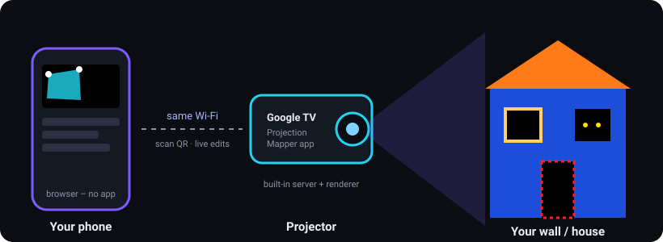

# Projection Mapper

Free, open projection mapping for **Google TV / Android TV projectors**, controlled from your **phone**.
Think "Lazy Lighting", without the paywall.

- Install one app on the projector. It shows a QR code.
- Scan the QR code with your phone. The controller opens in your phone's browser. There's nothing to install on the phone.
- Add shapes, drag their corners onto your walls, windows, doors or props, then pick effects, photos or videos.



## Features

| | |
|---|---|
| **Mapping** | Rectangles (true perspective warp), triangles, circles/ellipses, free shapes with up to 64 corners. Drag corners on the phone while a crosshair on the wall shows the exact corner. Magnifier loupe while dragging, "fine drag" mode, pixel-perfect arrow pad (1/5/25 px), scale/rotate/mirror, add or remove corners, layers, lock, hide, duplicate. |
| **25 animated effects** | Solid, Gradient, Rainbow, Color Cycle, Breathe, Strobe, Plasma, Fire, Water, Stripes, Checker, Sparkle, Clouds, Scanner, Spiral, Ripples, Edge Glow, Marquee Lights, Storm, Snowfall, Spooky Eyes, Digital Rain, Dot Wave, TV Static, Lava Lamp. Every one has colors, speed, size and an effect-specific slider. All run on the GPU. |
| **Your own media** | Upload photos and videos straight from your phone's gallery and map them onto any shape (stretch / fill / fit, tint). |
| **Themes** | One tap re-skins every shape: Halloween 🎃, Christmas 🎄, Party 🪩, Chill 🌊, Fire & Ice, Architecture, All White. |
| **Scenes + slideshow** | Save looks as scenes, switch instantly, or cycle through them automatically with a crossfade. The projector keeps running the slideshow when your phone is off. |
| **Show control** | Blackout, master brightness, edit-mode outlines on/off, alignment grid, soft edges, opacity, background color, flash shape names. |
| **Comfort** | Undo/redo, auto-save on the projector, export/import backups, several phones at once, auto-reconnect, works offline on your home Wi-Fi. |

## Install on the projector (Google TV / Android TV)

Every push to this repository builds the app automatically (GitHub Actions). The current APK is on the
[**Releases → latest**](../../releases/tag/latest) page as `projection-mapper.apk`.

Pick whichever install method is easiest for you.

### Option A – "Send Files to TV" (no computer needed)

1. On the projector, open the Play Store and install **Send Files to TV**. Install the same app on your phone.
2. On your phone, download `projection-mapper.apk` from the Releases page (you need to be logged in to GitHub, because the repo is private).
3. On the projector: **Settings → Apps → Security & restrictions → Unknown sources** and allow **Send Files to TV**.
   On some models it's **Settings → Privacy → Security & restrictions**.
4. Open Send Files to TV on both devices. On the TV choose **Receive**, on the phone **Send** and pick the APK.
5. When it arrives, open it on the TV and choose **Install**.

### Option B – ADB from a computer

1. On the projector: **Settings → System → About**, then click **Android TV OS build** 7 times to unlock developer options.
2. **Settings → System → Developer options** and turn on **USB debugging** / **Wireless debugging**
   (on Google TV 12+, use *Wireless debugging → Pair device with pairing code*, then run `adb pair IP:PORT` first).
3. Run:
   ```sh
   adb connect <projector-ip>:5555     # or the port shown under Wireless debugging
   adb install -r projection-mapper.apk
   ```

### Option C – "Downloader" app (only if you make the repo public)

The Downloader app (by AFTVnews) can fetch
`https://github.com/StrandedTurtle/projection-mapping/releases/latest/download/projection-mapper.apk` directly.
That link only works for public repos.

> Updates install over the top and keep your saved mapping, because every build is signed with the same key
> (`android/app/projection-mapper.keystore`).

## Use it

1. Open **Projection Mapper** on the projector. You'll find it in *Apps*, with a banner you can pin to the home screen.
2. Connect your phone to the **same Wi‑Fi** and scan the QR code, or type the address shown (e.g. `http://192.168.1.50:8080`).
   Tip: add it to your home screen for a full-screen app.
3. Tap **+ Rectangle**. On the wall you'll see the outline. Drag each corner on your phone until it sits exactly on
   the edge of your wall, window, door or box. Use the arrow pad for the last few pixels.
4. Open **Look** and pick an effect or upload a photo/video. Or open **Scenes** and tap a **Theme**.
5. Tap the **outline button** (top bar) to hide the edit outlines, and enjoy.

**TV remote:** OK/Enter shows or hides the QR code. Press Back twice to exit (so you don't end a show by accident).

### Mapping tips

- Put the projector somewhere solid first. Every bump means re-aligning.
- Map big surfaces first (the wall), then details (windows, doors) on top. Shapes higher in the list are drawn on top.
- To keep light *off* something (a window, a plant), put a shape over it with **Solid** black.
- **Circle** is a perspective-correct ellipse: great for round windows, pumpkins and plates.
- **Free shape**: tap the small ＋ between two corners to add a corner there.
- **Soft edge** blends a shape into the darkness. **Edge Glow** and **Marquee Lights** follow the shape's outline.
- Turn on **Projector → Alignment grid** to line the projector up with the scene.

## No Android TV? Run it on a computer

Any computer connected to the projector over HDMI works, as long as it has [Node.js](https://nodejs.org) 18+:

```sh
node server/server.js            # optional: --port 8080 --data ./data
```

Open `http://localhost:8080/display.html` full screen on the projector (double-click or press **F** for full screen),
and scan the QR code with your phone. You can also use the Java server from the Releases page:
`java -jar projection-mapper-server.jar --web web`.

## Troubleshooting

| Problem | Fix |
|---|---|
| Phone can't open the address | Phone and projector must be on the same network. Guest Wi‑Fi and "AP/client isolation" block devices from seeing each other. Turn off VPNs on the phone. |
| QR shows a strange IP | The projector may have Ethernet and Wi‑Fi at the same time. Try the other address, or disconnect the one you don't use. |
| "Projector app closed" on the phone | Open Projection Mapper on the projector again. The phone reconnects automatically. |
| Video doesn't play | Use MP4 (H.264). Very large 4K videos may be too heavy for small TV chips; 1080p is ideal. |
| Effects stutter | Fewer large overlapping shapes help. Heavy effects: Water, Fire, Clouds, Lava Lamp. |

## How it works / development

```
web/                    The whole app: plain HTML + ES modules, no build step
  display.html          projector output (WebGL renderer + QR code + outlines)
  index.html            phone controller
  js/engine/            geometry (homography, triangulation), effects (GLSL), renderer
  js/state.js           project model + deterministic "ops" shared by projector & phones
server/server.js        zero-dependency Node server (static files, WebSocket relay, uploads)
android/
  server/               the same server in plain Java (runs inside the TV app, or as a desktop jar)
  app/                  Android TV app: starts the server, shows display.html full screen
tests/                  unit tests + Playwright end-to-end tests (run against BOTH servers)
```

- Every surface is drawn by the GPU. Each shape's content is computed per pixel through the inverse perspective
  homography of its 4 corners, so textures stay straight on angled walls. Free shapes use ear-clipping triangulation.
- The projector holds the project and saves it (`/api/state` + localStorage). Phones send small edit operations over a
  WebSocket; the server just relays them. Every device applies the same deterministic ops, so all stay in sync.

```sh
npm install
npm test            # unit tests
npm run test:e2e    # headless Chromium: projector page + phone pages through the Node AND Java servers
npm start           # run locally on :8080
```

Building the APK locally needs the Android SDK: `cd android && ./gradlew assembleRelease`.
